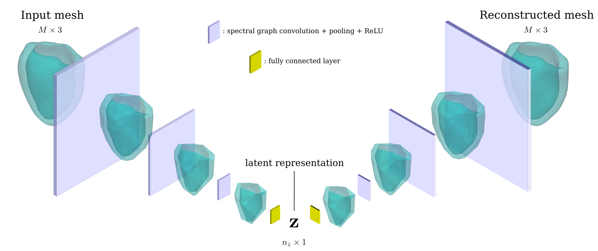

# Fork of CoMA for processing of CMR-derived cardiac meshes 

This is a reimplementation of [COMA](https://github.com/anuragranj/coma) to be used for cardiac meshes derived from cardiovascular magnetic resonance (CMR) in [CISTIB](http://www.cistib.org/) using the SpASM method.



Please follow the licensing rights of the authors if you use the code.

## Requirements
This code has been tested on PyTorch v1.4.

Requirements can be met by creating a Conda environment and running the following command

```
conda env create -f install/requirements.yml
```

This will create an environment called `pytorch_coma` (this name can be changed by editing the `name` field in the above `yaml` file).
Additionally, the following packages, which do not seem to be available in any Conda channel, can be installed with `pip` by executing the following commands:

```
conda activate pytorch_coma
export CUDA=<cuda_version>   # e.g. "cpu" or "cu101" (for CPU or CUDA 10.1)
export PYTORCH=1.4.0         # or whichever PyTorch has been installed
bash install/other_requirements.sh 
```

Install mesh processing libraries from [MPI-IS/mesh](https://github.com/MPI-IS/mesh).

## Data Preparation
### Converting from VTK files to Numpy binary files
The scripts assume that the files containing the 3D mesh information are in binary Numpy format (npy). There is a script in this folder, called `processData.py`, which serves this purpose. To produce these files, run

```
python processData.py \
  --data <SOURCE_DATA> \
  --save_data <OUTPUT_FILE> \
  --partition <PARTITION_NAME> \
  --N_subj <N_SUBJ>
```

where parameters are:
- `data` (string, required): name of a folder containing the VTK files. By default, it is assumed to contain folders, each named as the subject's ID, whose content are the VTK files. So far, only one file per subfolder is supported.
- `save_data` (string, required): output file path. 
- `partition` (string, required): one of LV, LV_endo, LV_epi, RV, LA or RA. 
- `N_subj` (integer, not required): number of subjects considered. By default, it will assume that all the individuals in the `data` folder are to be extracted.

In the case of biventricular or 4-chamber cardiac meshes, typically you would like to extract a single chamber (ventricle or atrium). This is achieved by setting `PARTITION_NAME` as LV[_endo|_epi], RV, LA or RA.

The VTK files derived from CISTIB's segmentation pipeline contain a label for each vertex, indicating which chamber it belongs to (in case of LV, endocardium and epicardium are distinguished); these label are integers between 1 and 5. For more details check out the [VTKHelpers](www.github.com/rodbonazzola/VTKHelpers.git) repository.

The **output file** will be a binary Numpy file containing a tensor of order 3. First axis will represent subjects, second axis means vertex across the mesh, and the third axis represent the spatial coordinate (x, y and z). Also, an additional file containing the subjects' IDs in the same order in which they appear in the tensor.
Note that this script does not produce centered, standardized or Procrustes-aligned data.


### Define the run parameters

By running the following command
` python config_parser.py`
a reference configuration file is created.

As stated above, the run parameters are specified through a configuration file.

## Training the network

The training of the autoencoder is performed by executing the following command:

```
python main.py --config <CONFIG_FILE>
```

All the parameters regarding the input files, output paths, network architecture and training process will be specified in this configuration file.
An additional `--test` flag can be used, which overwrites some of the parameters in the configuration file (in particular, number of training and validadtion samples, and number of epochs)

_This section is incomplete!_ A thorough description of the configuration file should be provided here. Also, the assumptions regarding the format of the input data should be detailed in this section.

### Output

My suggestion is either 1) to create a directory called `output` in the repository's root directory, or 2) create a symbolic link called `output` in the same location, pointing to the location where the output is actually stored in the file system. The reason for this suggestion is that the scripts for downstream analysis assume this structure.
```buildoutcfg
cd $(git rev-parse --show-toplevel) # to go to the root from wherever within the repo
ln -s <ACTUAL_OUTPUT_LOCATION> output
```

Running the training will generate a set of files as output, all of which are included in the output directory specified in the configuration file (by default, `output/{TIMESTAMP}`.
These files are displayed hh 
```
output/<RUN_DIRECTORY>/
├── checkpoints
│   ├── checkpoint_1.pt
│   ├── ...
│   └── checkpoint_<N_EPOCHS>.pt
├── log
├── config.json
├── latent_space.csv
├── best_model.pkl
├── last_model.pkl
├── training_losses.csv
└── performance.csv
```

The `latent_space.csv` file provides the values of the latent variables calculated for each of the meshes in the input file, for the model state in the _last epoch_. This is an example of the first few lines: 

```buildoutcfg
ID,z0,z1,z2,z3,z4,z5,z6,z7,subset
ID1,0.6727646,1.2197632,-0.0015632831,-0.0017964276,-0.0011379608,-0.00194904,0.00086465623,0.43605334,train
ID2,-0.3583794,1.0516549,0.0001953443,-0.0006836358,-0.00025662401,-0.0004789658,-0.00023865222,-0.5036721,train
ID3,-0.2379153,0.8318247,0.00022164031,-0.0007455249,-0.00033490564,-0.00063846295,-0.0002699971,-0.6040641,train
ID4,-0.7069901,1.4906299,6.0322054e-06,-0.0002893256,4.4499597e-05,-2.0823209e-05,-8.55219e-05,0.40577632,validation
ID5,-0.06829553,-0.70609236,0.0007860548,0.0009309872,0.00024757718,0.0002669077,-0.0012372131,-0.8257334,validation
ID6,-1.4899338,-0.019097518,0.0012145299,0.00025489152,-0.0018176663,0.00059964956,0.00084737624,-0.96989465,test
ID7,-1.4795663,-0.9658994,0.0015057126,0.000762574,-0.0011964515,0.0012116398,0.00087300077,-0.3182309,test
```

The `performance.csv` file provides a measure of the performance of the algorithm in the different partitions of the input dataset:

```buildoutcfg
ID,mse,subset
ID1,0.0019662778,train
ID2,0.001438949,train
ID3,0.0013602609,train
ID4,0.0023200116,validation
ID5,0.0048691565,validation
ID6,0.001930836,test
ID7,0.0021707348,test
```
In both files, the last column, `subset` indicates to which partition (`train`, `validation`, or `test`) each subject belongs to for the given experiment. Importantly, _this is the only place where this information is recorded_.

The `config.json` copies the input configuration file, adding only the value of the seed used for random number generation (to ensure full reproducibility of the experiment), and the ID of the experiment (by default, this is a time stamp).

`best_model.pkl` and `last_model.pkl` contain the model state for the best model (according to total loss in the validation set) and the last model, respectively.

`training_losses.csv` contains the values of the different loss terms for the training and validation test throughout the training:
```buildoutcfg
epoch,reconstruction_loss_training,KLD_loss_training,loss_training,reconstruction_loss_eval,KLD_loss_eval,loss_eval
1,3.00000,0.82429,0.00000,0.82429,0.69223,0.00000,0.69223
2,3.00000,0.82417,0.00000,0.82417,0.69209,0.00000,0.69209
3,3.00000,0.82399,0.00000,0.82399,0.69192,0.00000,0.69192
```

### Analyzing the experiments 
_Complete this section!_ It should contain a description of the different Jupyter notebooks and of the `ComaExperiment` class. 
    
## GWAS
This assumes that the [GWASPipeline](www.github.com/rodbonazzola/GWAS_pipeline.git) has been either downloaded into this repository's root folder, or a symbolic link was created that points to the actual location of the repository in your file system. In Unix-like systems, it could be done by running

```
ln -s <GWAS_PIPELINE_REPO_PATH> GWAS_pipeline
```
  
## Work to do

- Document how to use the `ComaExperiment` class defined in the `ExperimentClass.py`. It provides an interface to extract all the relevant information from a run of the training algorithm. 
- Manage configuration in a single way. Now I am using a format for input and another format for output (JSON). Also, the way I am storing the configuration in the JSON is not compatible for reading with R, which gives me trouble when analyzing the results in R.
- Add a small file showing total execution time and some measures of performance (e.g. mean and standard deviation of the latent codes K-S test for gaussianity, etc.). Provide the content using a `summary` method of the `ComaExperiment` class.
- Add the possibility to change activation function in each layer.
- Resolve the `#TODO`'s contained in the code.
- It would be good idea to provide the code for Shiny App to analyze the results in folder named `analysis`.

## Acknowledgments

- [Max Planck Institute for Intelligent Systems](https://github.com/MPI-IS) for the development of [libraries for mesh processing](https://github.com/MPI-IS/mesh), on which this implementation relies. In particular, [Anurag Ranjan](https://github.com/anuragranj) et al. for the development of CoMA and its [initial implementation of CoMA](https://github.com/anuragranj/coma) in TensorFlow 1 (currently deprecated), and [Priyanka Patel](https://github.com/pixelite1201) for the [re-implementation of CoMA in PyTorch](https://github.com/pixelite1201/pytorch_coma) which this one is based on. 
